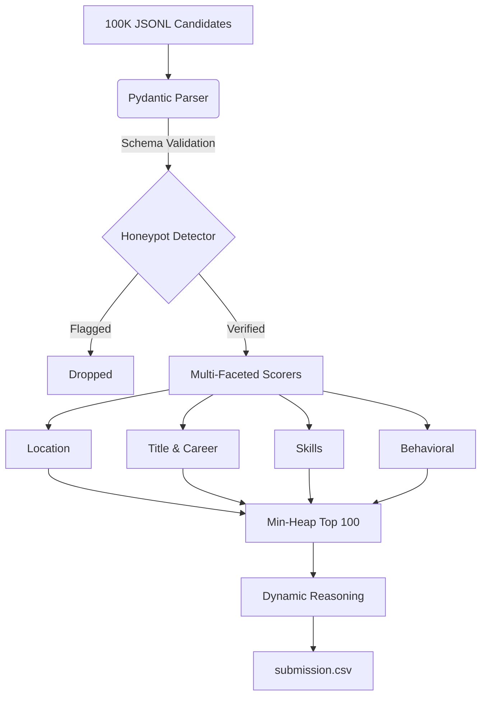

# Avera: Candidate Ranking Engine

## Intro
Avera is a highly optimized, deterministic ranking engine that evaluates 100,000 candidate profiles in ~16 seconds. It strictly evaluates technical candidates against objective Job Description constraints, utilizing behavioral heuristics and career trajectory analysis to identify senior product engineers while filtering out keyword-stuffing anomalies.

## Tech Stack
- **Python 3.13**: Core logic implementation.
- **Pydantic**: Defensive input validation and schema enforcement at the system boundary.
- **Pytest**: Automated test suite for determinism and edge-case validation.
- **Git**: Version control.

## Features
- **O(N log K) Min-Heap Ranking**: Processes 100K records in memory-efficient `O(K)` space instead of `O(N log N)` sorting.
- **Honeypot Detection**: Identifies mathematically impossible experience timelines (e.g., claiming 7 years of framework experience with only 4 years total career length).
- **Product vs. Services Scoring**: Distinguishes candidates from product-focused companies over pure IT consulting.
- **Dynamic Reasoning Extraction**: Parses verified skills to dynamically generate explainable reasoning for why a candidate was chosen, preventing template hallucination.
- **Graceful Degradation**: Input parser skips malformed JSON lines instead of crashing the pipeline.

## Process
The initial architecture explored LLMs and semantic embeddings for ranking. However, evaluating candidates strictly against objective constraints (like Years of Experience or Location) requires *determinism*. 

The dataset contained numerous "Honeypots"—fake candidates with heavily keyword-stuffed profiles but impossible behavioral signals (e.g., 20 skills but 0 assessments). 

To ensure strict memory bounds and deterministic tie-breaking, we implemented an `O(N log K)` Min-Heap:

```python
# We use a Min-Heap to bound memory usage to O(K) instead of O(N).
import heapq

heap = []
for candidate in candidates:
    score, reasoning = self.score_candidate(candidate)
    if score == 0.0:
        continue
        
    # We use a negative candidate_id integer for strict tie-breaking.
    # If scores are equal, we want to KEEP the smallest candidate_id, 
    # so we pop the LARGEST candidate_id (which is why we invert it).
    id_num = int(candidate.candidate_id.split("_")[1])
    tie_breaker = -id_num
    
    item = (score, tie_breaker, candidate, reasoning)
    
    if len(heap) < 100:
        heapq.heappush(heap, item)
    else:
        heapq.heappushpop(heap, item)
        
# Output: A strictly bounded list of the absolute top 100 candidates, deterministically tie-broken
```

### System Architecture
The data ingestion and scoring pipeline follows a strict sequential processing pattern:



## Learnings
Data validation at the boundary is critical for large-scale ingestion. We implemented Pydantic models to safely coerce types and reject structurally invalid data, ensuring the core scoring logic never encounters a `TypeError`. We logged all architectural decisions in the `docs/adr/` directory to prevent "decision amnesia" as the system scales.

## Improvement
Future iterations will introduce containerization (Docker) and an automated CI/CD pipeline for security scanning and regression testing on every push.

## Running the Project
1. Ensure the dataset is located at `DataSet/candidates.jsonl`.
2. Run the test suite:
   ```bash
   python -m pytest tests/
   ```
3. Execute the ranking engine:
   ```bash
   python rank.py --candidates DataSet/candidates.jsonl --out submission.csv
   ```
4. Validate the output format:
   ```bash
   python DataSet/validate_submission.py submission.csv
   ```
