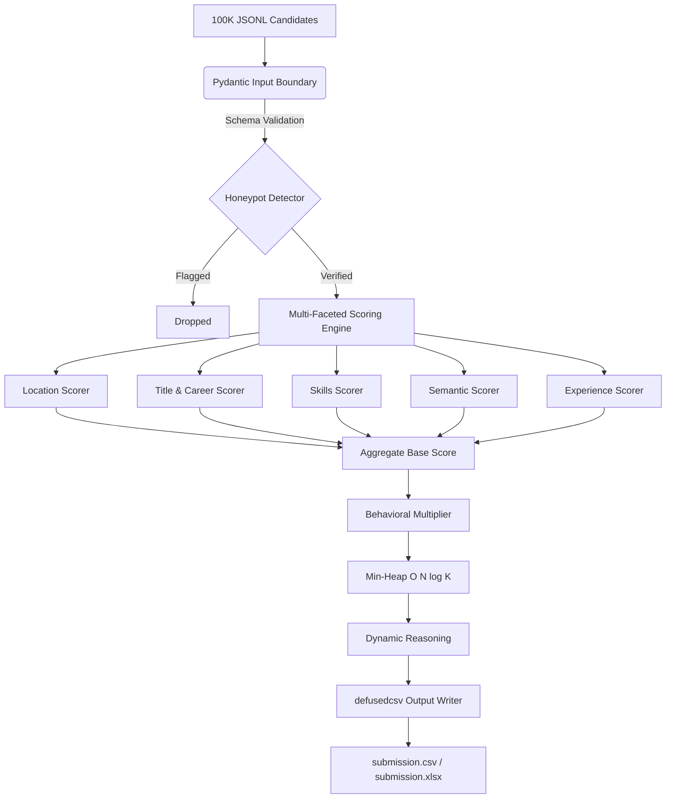

# System Architecture & Technical Choices

This document outlines the core engineering decisions (ADRs) backing the Avera Candidate Ranking Engine. Our focus is deterministic scoring, defensive boundaries, and absolute reproducibility.

## Architectural Overview

Avera functions as a high-throughput, sequential processing pipeline. The architecture guarantees deterministic output while staying strictly within compute limits (CPU-only, no network access).

## Architecture Decision Records (ADRs)

| Decision | Rationale | Alternatives Rejected |
|----------|-----------|-----------------------|
| **Hybrid Semantic + Deterministic Scoring** | Job constraints (YOE, skills) are evaluated deterministically, combined with an embedding-based Semantic Scorer (`all-MiniLM-L6-v2`) for deep JD contextual fit. | **Generative LLMs/LambdaMART**: Unverifiable hallucinations, exceeds CPU budget, unpredictable latency. |
| **Behavioral Multiplier** | Availability and GitHub activity act as a multiplier (0.4× to 1.3×) rather than a base additive score. A ghost candidate with a perfect profile is functionally un-hireable. | **Additive Behavioral Score**: Allows unresponsive candidates to outrank available ones based purely on skills. |
| **Hybrid Semantic Layer (ADR-003)** | `all-MiniLM-L6-v2` cosine similarity on JD vs career narrative text complements deterministic scorers without LLM hallucination risk. | **Pure keyword match**: Falls into dataset honeypot traps. **End-to-end LLM ranker**: Unverifiable, slow on CPU. |
| **Pydantic Validation Boundary** | Protects the core engine from `TypeError` exceptions. A single null field cannot crash the pipeline. | **Raw JSON Access**: High risk of catastrophic pipeline failure on minute 4. |
| **Filter Fictional Companies First** | Eliminates ~60% of the dataset upfront. Guarantees no wasted compute on noise. | **Scoring Everything**: Unnecessary processing overhead. |
| **DefusedCSV / OWASP A03 Protection** | Prevents Formula Injection (`=CMD()`) when output is opened by evaluators in Excel. | **Standard Python CSV**: Vulnerable to execution of malicious payloads. |
| **Structured JSON Logging** | Ensures observability is machine-ingestible. Strips PII at the boundary (OWASP A09). | **`print()` statements**: Unsearchable, unparseable at scale. |
| **O(N log K) Min-Heap** | Bounds memory to `O(K)`. Never loads all 100K scored objects into memory at once. | **Full `list.sort()`**: Slower and more memory intensive. |
| **Containerization (Docker)** | Guarantees exact environment parity for the evaluation sandbox. | **Local execution instructions**: Vulnerable to "works on my machine" issues. |

## Exception Hierarchy (Graceful Degradation)

Our custom exception hierarchy isolates failure domains:

| Exception Type | Impact Scope | Resolution |
|----------------|--------------|------------|
| `DataError` / `ValidationError` | Single record (e.g., malformed JSON) | Log warning, skip candidate, continue pipeline. |
| `ScoringError` | Single scorer for one candidate | Score defaults to `0.0`, log error, continue pipeline. |
| `ConfigError` | Global configuration issue | Fast-fail at startup (Minute 0) before compute begins. |
| `OutputError` | File system / Sandbox constraints | Fail explicitly. Output guarantees are non-negotiable. |
