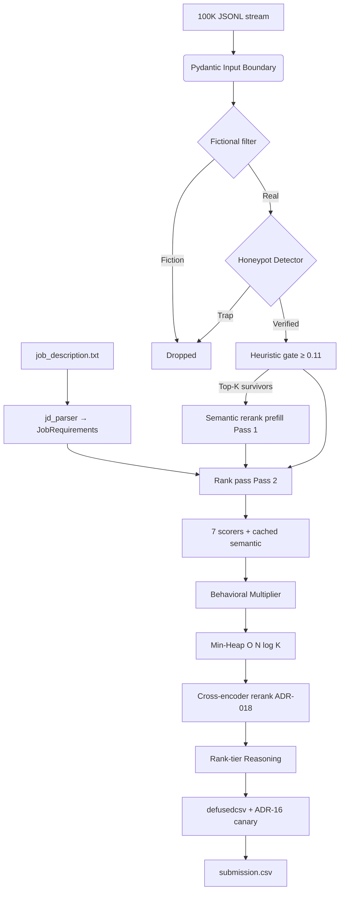

# System Architecture & Technical Choices

This document outlines the engineering decisions (ADRs) behind the Avera Candidate Ranking Engine. The focus is **deterministic scoring**, **defensive boundaries**, and **reproducible operations** at India-scale throughput on CPU.

## Why this architecture

Redrob's dataset punishes naive keyword rankers. Avera is architected as a **streaming hybrid ranker**:

- **Deterministic core** — auditable constraints (YOE, skills, cities, honeypots) that judges and compliance reviewers can trace.
- **Semantic layer** — embeddings capture career narrative fit the JD asks for, without LLM hallucination risk.
- **Operational shell** — Docker, CI, structured logs, and offline model delivery so the PoC is demonstrable and maintainable.

See also: [methodology.md](methodology.md) for scorer detail · [README.md](../../README.md) for the product-level "why" narrative.

## Architectural Overview

Avera is a **two-pass streaming pipeline**. Pass 1 batch-encodes semantic vectors for heuristic gate survivors; Pass 2 scores and maintains a min-heap top-K without materializing all 100K scored candidates.



## Component map

| Module                               | Responsibility                                                                              |
| ------------------------------------ | ------------------------------------------------------------------------------------------- |
| `rank.py`                            | CLI orchestration: health check, path validation, `--fast` flag, prefill timing, pipeline summary log |
| `src/parsers/jd_parser.py`           | JD → `JobRequirements` (skills, cities, seniority, title keywords)                          |
| `src/parsers/candidate_parser.py`    | Streaming JSONL ingest with size guards                                                     |
| `src/ranker.py`                      | Filter → score → heap; `prefill_semantic_stream()` for Pass 1                               |
| `src/scorers/*`                      | Title/career, skills, semantic, experience, location, education, trajectory, behavioral     |
| `src/rerank.py`                      | Cross-encoder rerank on the shortlist pool (ADR-018)                                        |
| `src/detectors/honeypot_detector.py` | Five-method adversarial trap detection (incl. multi-domain expert trap)                     |
| `src/scorers/behavioral_scorer.py`   | Behavioral multiplier + `join_probability()` (informational, not in rank score)             |
| `src/reasoning.py`                   | Deterministic rank-tier explanation strings                                                 |
| `src/output_writer.py`               | defusedcsv write + output canary                                                            |
| `app.py`                             | Gradio sandbox (HF Space)                                                                   |
| `scripts/eval.py`                    | Honeypot rate, NDCG@10, Precision@5/10, Recovery@10, optional benchmark                     |
| `scripts/test_generalization.py`     | Two-JD zero-edit generalization proof                                                       |

## Architecture Decision Records (ADRs)

| Decision                                    | Rationale                                                                                                                                                                      | Alternatives Rejected                                                                                           |
| ------------------------------------------- | ------------------------------------------------------------------------------------------------------------------------------------------------------------------------------ | --------------------------------------------------------------------------------------------------------------- |
| **Hybrid Semantic + Deterministic Scoring** | Job constraints (YOE, skills) are evaluated deterministically, combined with an embedding-based Semantic Scorer (`all-MiniLM-L6-v2`) for deep JD contextual fit.               | **Generative LLMs/LambdaMART**: Unverifiable hallucinations, exceeds CPU budget, unpredictable latency.         |
| **Two-stage funnel (gen then rerank)**      | Batch encode only the heuristic top-K (`SEMANTIC_RERANK_TOPK`, default 5000); rank pass stays O(N) streaming with O(K) heap memory. Cut a 100K CPU run from ~43 min to ~6 min. | **Encode every survivor**: ~7x slower with no material top-100 change.                                          |
| **Domain-branching taxonomy (ADR-17)**      | `detect_domain` selects DevOps or AI/ML title and skill tables so non-AI/ML JDs rank on the right signals.                                                                     | **Single hardcoded AI/ML taxonomy**: 0 DevOps titles in a DevOps-JD top-100.                                    |
| **Cross-encoder rerank (ADR-18)**           | Min-max normalized logits (no sigmoid); bounded additive blend on shortlist pool; **final clamp to [0, 1]**. | **Sigmoid on logits** or **rerank whole pool**: clustering bug or latency blow-up.                              |
| **Skill adjacencies + synonyms**            | Curated partial credit for vector-DB cousins and narrative skill names (e.g. embeddings).                                                                                      | **1.4M skill graph**: out of scope for CPU PoC.                                                                 |
| **Join probability (informational)**        | India hireability signals in XLSX + reasoning; CSV stays 4 columns for organizer validation.                                                                                   | **Fifth CSV column**: breaks portal validator.                                                                  |
| **Heuristic semantic gate (0.11)**          | Skip embeddings for weak heuristic matches; preserves CPU budget on 100K.                                                                                                      | **Encode all 100K**: violates hackathon time budget.                                                            |
| **Behavioral Multiplier**                   | Availability and GitHub activity act as a multiplier (0.4× to 1.3×) rather than a base additive score. A ghost candidate with a perfect profile is functionally un-hireable.   | **Additive Behavioral Score**: Allows unresponsive candidates to outrank available ones based purely on skills. |
| **Seniority-aware weights**                 | Junior JDs weight skills higher; senior JDs weight title/career trajectory higher — parsed from JD text.                                                                       | **Fixed weights for all JDs**: misaligned when role level changes.                                              |
| **Pydantic Validation Boundary**            | Protects the core engine from `TypeError` exceptions. A single null field cannot crash the pipeline.                                                                           | **Raw JSON Access**: High risk of catastrophic pipeline failure on minute 4.                                    |
| **Filter Fictional Companies First**        | Eliminates ~60% of the dataset upfront. Guarantees no wasted compute on noise.                                                                                                 | **Scoring Everything**: Unnecessary processing overhead.                                                        |
| **DefusedCSV / OWASP A03 Protection**       | Prevents Formula Injection (`=CMD()`) when output is opened by evaluators in Excel.                                                                                            | **Standard Python CSV**: Vulnerable to execution of malicious payloads.                                         |
| **Structured JSON Logging**                 | `trace_id`, `run_id`, `latency_ms`, `prefill_ms`, `seniority_level` — machine-ingestible; PII stripped at boundary.                                                            | **`print()` statements**: Unsearchable, unparseable at scale.                                                   |
| **O(N log K) Min-Heap**                     | Bounds memory to `O(K)`. Never loads all 100K scored objects into memory at once.                                                                                              | **Full `list.sort()`**: Slower and more memory intensive.                                                       |
| **Containerization (Docker)**               | Baked MiniLM; guarantees exact environment parity for the evaluation sandbox.                                                                                                  | **Local-only instructions**: Vulnerable to "works on my machine" issues.                                        |
| **mypy + determinism test**                 | Static types on `src/` + SHA256 replay on ranking fixture.                                                                                                                     | **Untyped Python**: regressions slip through CI.                                                                |

## Observability

`rank.py` emits structured JSON on completion and prints a one-line `Pipeline summary:` to stdout:

```json
{
  "event": "ranking_done",
  "trace_id": "<uuid>",
  "input_count": 100000,
  "filtered_fictional": 59749,
  "filtered_honeypot": 1603,
  "semantic_gate_pass": 38641,
  "scored_count": 38648,
  "prefill_ms": 981294,
  "score_ms": 468990,
  "ce_rerank_ms": 134062,
  "semantic_encoded": 5000,
  "latency_ms": 603218,
  "seniority_level": "senior",
  "output_count": 100
}
```

## CI pipeline

GitHub Actions (`/.github/workflows/ci.yml`):

`governance` → `lint` → `test` + `security` + `mypy` → `integration` (smoke rank + `test_generalization.py`) → `docker-smoke`

Local equivalent: `make ci`

## Exception Hierarchy (Graceful Degradation)

| Exception Type                  | Impact Scope                         | Resolution                                             |
| ------------------------------- | ------------------------------------ | ------------------------------------------------------ |
| `DataError` / `ValidationError` | Single record (e.g., malformed JSON) | Log warning, skip candidate, continue pipeline.        |
| `ScoringError`                  | Single scorer for one candidate      | Score defaults to `0.0`, log error, continue pipeline. |
| `ConfigError`                   | Global configuration issue           | Fast-fail at startup (Minute 0) before compute begins. |
| `OutputError`                   | File system / Sandbox constraints    | Fail explicitly. Output guarantees are non-negotiable. |
